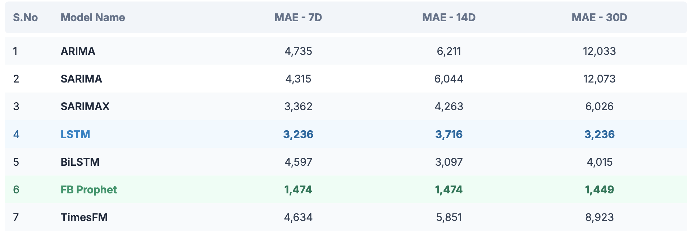
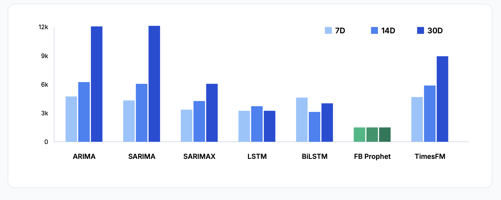

# Impression Forecast Model (IFM)

**Authors:** Junaid Ahmad ([ja4893@rit.edu](mailto:ja4893@rit.edu)), Fardin Anam Aungon ([fa4111@rit.edu](mailto:fa4111@rit.edu)), and Subash Velmurugan ([sv9252@g.rit.edu](mailto:sv9252@g.rit.edu))

## Problem Statement:

To develop a time-series regression model that predicts the number of downloads for an application on day T, given a feature vector X representing the preceding n days of historical data.

## Motivation:

For App developers having a model that can predict the future downloads is invaluable. It can help them make better decisions to improve their businesses.

Some use cases can be:
- **To optimize UA (User Acquisition / Ad spend) spend** to reach quarterly targets.
- **Outlier detection:** Developers can detect recent update performance on organic growth.
    - Increase downloads due to store listing updates.
    - Reduction in downloads due to increased crashes in a new update.

## Methodology

1. **Data Collection & Integration:** Collect all time-series data into a Google Sheet file.
2. **Preprocessing:** Determine the best way to preprocess the data (Handling missing dates, smoothing ratings, etc.).
   - See [Data Preprocessing Guide](resources/data_preprocessing.md).
3. **Data Splitting:** Split the data into training and test sets. **Note: Time-series data must be split by time, not randomly.**
4. **Baseline Modeling:** Run traditional regression algorithms to create the initial model ([ARIMA, SARIMA and SARIMAX](code/models/arima/arima_family.ipynb)).
5. **Advanced Modeling:** Research and implement subsequent models ([LSTM](code/models/lstm/lstm_model.ipynb), [BiLSTM](code/models/lstm/bilstm_model.ipynb)).
6. **State-of-the-Art Implementation:** Run the data through SOTA Models ([Facebook’s Prophet](code/models/sota/prophet_forecast.ipynb), [Google's TimesFM](code/models/sota/timesfm_forecast.ipynb)).
7. **Evaluation:** Evaluate the results using time-series metrics (MAE, RMSE).

## Evaluation :

We used MAE to compare all the results.

**Forward Prediction**: 
For this we predicted the downloads in a forward step manner without looking at the actual downloads.
It keeps processing forward without re-orienting with the actual test data

**Rolling Prediction**: 
In this method we re-orient the prediction of the downloads every 7, 14 or 30 days. This removes major errors.
This is what we are using in the following results.






## Future Work :

- **Model Generalization**: Predict from other datasets using pretrained models
- **Robustness Check**: Evaluate underfit/overfit on diverse game data
- **Product/SAAS**: Create tool for data import and forecast projection for other developers
- **Other Time-Series Models**: ETS, SVR, Autoformer, Amazon Chronos, TimeGPT

---

## Github Link
https://github.com/Junaidsgs/IFM.git

## Getting Started

### 1. Clone the repository
```bash
git clone https://github.com/Junaidsgs/IFM.git
cd IFM
```

### 2. Set up a virtual environment
It is recommended to use a virtual environment to manage dependencies.
```bash
python3 -m venv .venv
source .venv/bin/activate  # On Windows use `.venv\Scripts\activate`
```

### 3. Install dependencies
Install the required Python packages using pip:
```bash
pip install -r requirements.txt
```

### 4. Running the code
The project contains several Jupyter notebooks in the `code/models/` directory for different modeling approaches. You can start Jupyter Lab or Notebook to explore them:
```bash
pip install jupyterlab
jupyter lab
```
